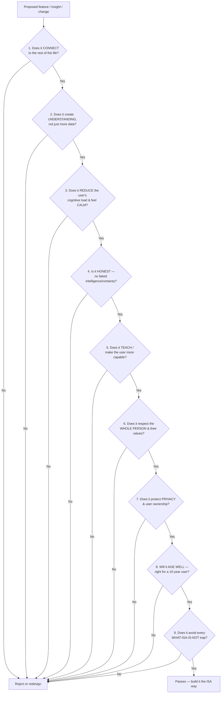

# ISA — Core Philosophy

> **Status:** Official · Permanent · Foundational
> **Document type:** Product DNA — every future product, design, engineering, and AI decision must be traceable to this document.
> **Audience:** Everyone who builds, designs, or reasons about ISA.
> **Rule of use:** If a decision contradicts this document, the decision is wrong — not the document. This document changes only by deliberate amendment, never by drift.

ISA — **Intelligent System Assistant**. A Personal Life Operating System.

---

## 0. How to read this document

This is not a feature list and not a spec. It is the **set of beliefs** ISA is built on. Specs expire; beliefs compound. When you are unsure what to build, you do not ask "what do competitors do?" — you ask "what does ISA believe?" The answer is here.

Three sentences to hold in your head forever:

1. **ISA is not a place to store your life. It is a system that helps you live it better.**
2. **Information is cheap. Understanding is rare. ISA sells understanding.**
3. **Every part of a life is connected. Software that pretends otherwise is a filing cabinet, not an operating system.**

---

## 1. Why does ISA exist?

### The real human problem

A modern person's life is **fragmented across tools that don't know each other exist.**

- Tasks live in one app. Money in another. Goals in a third. Notes in a fourth. Calendar in a fifth. Health in a sixth. Faith, reflection, and energy — usually nowhere at all.
- Each tool sees a **thin slice** of the person and optimizes that slice in isolation. The finance app doesn't know you have a goal. The task app doesn't know you slept four hours. The habit app doesn't know you're overspending because you're stressed.
- The human is left to be the **integration layer** — the only entity holding the whole picture, doing it manually, in their head, badly, under load.

The result is a specific and universal kind of exhaustion: **you are managing your tools instead of your life.** You have more data about yourself than any human in history and less understanding of yourself than you'd like. Productivity tools made *capture* free and left *meaning* unsolved.

The deeper problem beneath the fragmentation:

> **People don't struggle because they lack information about their lives. They struggle because nothing connects that information into a picture they can act on.**

### Why another productivity app is not enough

A productivity app answers *"what do I have to do?"*. That question is already over-served. The unserved questions are the ones that actually change a life:

- *Am I moving toward the life I said I wanted?*
- *Why do my good weeks happen? Can I make more of them?*
- *What is quietly costing me — money, focus, energy, time — that I can't see because it's spread across six apps?*
- *When I'm about to break a promise to myself, will anything notice in time to help?*

No task manager can answer these, because **the answers live in the relationships between domains, not inside any one domain.** A better task list will never become a better life. That is the ceiling ISA is built to break.

ISA exists to be the **one system that holds the whole person** — and, because it holds the whole person, can finally turn a decade of scattered actions into self-knowledge, foresight, and momentum.

---

## 2. Vision (10 years)

**In ten years, ISA is the quiet intelligence that a person lives their life on top of.**

Not an app they open. A **layer they trust.** The way electricity is a layer — invisible, assumed, load-bearing.

A person who has used ISA for ten years should be able to say things no software today lets anyone say:

- "ISA understands how I actually work, not how I wish I worked."
- "ISA has watched every meaningful decision I've made for a decade, and it uses that to protect me from my own patterns."
- "When my life is drifting, ISA notices before I do — gently, early, and only when it matters."
- "ISA made me more capable. I depend on it less each year, not more."

Concretely, the 10-year arc:

| Horizon | What ISA is |
|---|---|
| **Today** | A unified Life OS with rule-based intelligence connecting modules. |
| **~3 years** | A system that reliably notices patterns across a person's whole life and surfaces them as calm, timely insight. |
| **~5 years** | A system that can *predict* — energy, spending, goal trajectories, habit fragility — and quietly help the user pre-empt problems. |
| **~10 years** | A **life intelligence** that understands a single human deeply enough to give counsel a wise friend would give: rare, specific, timed, and always in service of who that person is trying to become. |

The vision is emphatically **not** "an AI that runs your life for you." It is "**an intelligence that helps you run your own life better** — and keeps handing the wisdom back to you."

---

## 3. Mission

> **ISA exists to turn a person's scattered daily actions into self-understanding, foresight, and steady forward motion — calmly, privately, and in service of the life they actually want.**

How ISA improves a life, mechanically:

1. **It removes the integration tax.** The user stops being the manual glue between six tools. ISA holds the whole picture so the human can spend that energy living.
2. **It converts data into understanding.** Every logged action becomes part of a growing, connected picture of *how this specific person works* — not a static archive, but a live model.
3. **It gives foresight instead of hindsight.** Most tools tell you what already happened. ISA's aim is to tell you what is *about to* happen while you can still change it.
4. **It compounds.** A day in ISA is small. A year is a mirror. A decade is a form of self-knowledge no other software offers.
5. **It respects the whole person.** Work, money, health, focus, reflection, **and faith/values** — a life is not only productivity. ISA treats the person as a person, not a throughput machine.

---

## 4. What ISA IS

- **A Personal Life Operating System.** A single, coherent environment where every domain of a life lives together and *knows about* the others.
- **An intelligence layer, not a storage layer.** Its core value is what it *understands and connects*, not what it holds.
- **A calm, premium, fast environment** that a person is glad to open and glad to close — because it respects their attention.
- **A long-term companion.** ISA is designed to be used for years by the same person, getting quietly better at understanding them the longer they stay.
- **A private system.** The user's life data is theirs. ISA is a confidant, and behaves like one.
- **A teacher.** ISA's success is measured partly by how much *more capable the user becomes*, not how dependent.
- **Honest.** ISA says only what it actually knows, shows its reasoning, and never manufactures certainty it doesn't have.
- **Whole-life aware.** It includes the parts of life other tools ignore — energy, reflection, spiritual practice — because those parts are load-bearing.

---

## 5. What ISA IS NOT (and must never become)

These are permanent prohibitions. A feature that turns ISA into any of the following is rejected regardless of metrics.

- **ISA is NOT a productivity app.** It is not a better to-do list. The to-do list is one small organ, not the body.
- **ISA is NOT an engagement product.** It does not farm attention. Time-in-app is not a goal and is often a *failure*. ISA wins when it gives the user their time back.
- **ISA is NOT a dashboard of numbers.** Charts without meaning are noise. ISA never shows data it cannot help the user *understand or act on*.
- **ISA is NOT a chatbot.** It is not a conversation you must prompt. Intelligence is ambient, arriving when relevant — not a blank box demanding you ask the right question.
- **ISA is NOT a surveillance or scoring machine.** It does not judge, shame, gamify, or reduce a human to a leaderboard number. It does not use streaks as manipulation.
- **ISA is NOT an autonomous agent that runs your life.** It advises; the human decides. It never takes irreversible or value-laden action on the user's behalf without explicit consent.
- **ISA is NOT a data business.** The user's life is never the product. Insight is the product; the data stays the user's.
- **ISA is NOT a maximalist app that adds everything.** Every feature that doesn't serve the philosophy makes ISA worse. Restraint is a feature.
- **ISA is NOT loud.** No badges screaming for attention, no manufactured urgency, no dark patterns, no guilt.

> If you are ever tempted to add a feature that would make ISA "sticky," "addictive," or "engaging," you have misunderstood the product. ISA is meant to be **trusted**, not compulsive.

---

## 6. Core Principles

These are the beliefs every feature must embody. Each is a lens; a feature that fails a lens is redesigned or dropped.

### 6.1 Everything Connects

- **Purpose:** Treat the user's life as one connected system, never as isolated modules.
- **Reason:** All the value competitors leave on the table lives in the *relationships between domains*. A siloed feature is a competitor's feature. ISA's moat is the graph.
- **Examples:**
  - A drop in sleep quietly lowers the day's suggested focus load and softens habit expectations — without the user asking.
  - Overspending in a stressful week is surfaced *next to* the journal entry that explains why, not in an isolated finance chart.
  - Finishing a goal automatically reflects into the yearly review as a milestone, and its momentum is offered to the next goal.
- **Anti-example (rejected):** A finance report that never references goals, energy, or context — a silo pretending to be a feature.

### 6.2 Intelligence over Information

- **Purpose:** Sell understanding, not data. Never show a number ISA can't help the user interpret.
- **Reason:** People are drowning in their own metrics. The scarce, valuable thing is *meaning*: "here's what this means, and here's what to do."
- **Examples:**
  - Not "you spent 1,200,000 so'm on Food." Instead: "Food is up 30% vs last month — mostly weekend deliveries. Cutting to your average frees ~200,000 for your MacBook goal."
  - Not "3-day journaling streak." Instead: "You reflect most on Sundays; your best weeks start with a Sunday review."
- **Anti-example (rejected):** A raw stat with no interpretation, no comparison, no action.

### 6.3 Calm Interface (Calm Technology)

- **Purpose:** Respect the user's attention as the scarcest, most sacred resource.
- **Reason:** A Life OS holds a whole life; if it were loud, it would be unbearable. Calm is not aesthetic preference — it is a survival requirement for a system this central.
- **Examples:**
  - ISA speaks rarely, and when it does, it earns the interruption. Silence is the default state.
  - No red badges by default. No manufactured urgency. Notifications are few, personal, and timed.
  - The interface recedes; the user's life is the content, not the UI.
- **Anti-example (rejected):** Notification streams, "you have 14 updates," gamified nags.

### 6.4 Teach Instead of Store

- **Purpose:** Make the user more capable and more self-aware — not more dependent on the tool.
- **Reason:** Storage creates dependence; teaching creates growth. A tool that makes you helpless without it has failed a person, even if it's "sticky."
- **Examples:**
  - ISA reveals patterns the user can internalize ("your energy dips every Thursday"), so eventually the user knows this about themselves whether or not ISA is open.
  - Onboarding and empty states *teach the page's purpose*, not just where the button is.
  - Insights are phrased to build the user's own judgment, not to replace it.
- **Anti-example (rejected):** A black-box recommendation with no reasoning, training learned helplessness.

### 6.5 Progress Every Day

- **Purpose:** Honor small, daily, compounding motion — the ascent — over bursts and streaks-as-pressure.
- **Reason:** Real lives change by accumulation, not by heroics. ISA's whole metaphor is climbing a mountain a little each day.
- **Examples:**
  - The Ascent visual shows overall movement toward the summit; a single day is small and that's the point.
  - A missed day is information, not a punishment. Streaks describe reality; they never manipulate.
  - The system is designed so that *doing a little* is always rewarded with *seeing a little* progress.
- **Anti-example (rejected):** "You lost your 47-day streak!" guilt mechanics.

### 6.6 Honesty Over Illusion

- **Purpose:** Never fake intelligence, certainty, or capability ISA doesn't have.
- **Reason:** Trust is the entire product. A single fabricated insight poisons every future one. A Life OS must be believed.
- **Examples:**
  - Rule-based insights are presented as what they are — math over the user's own data — not dressed up as a mind.
  - When ISA doesn't have enough data, it says so plainly instead of inventing a pattern.
  - Reasoning is inspectable: "we say this because your Food category rose 30%."
- **Anti-example (rejected):** Confident advice from noise; hiding uncertainty to seem smart.

### 6.7 Privacy Is Sacred

- **Purpose:** Treat the user's life data as belonging entirely to them.
- **Reason:** People will only give a system their *whole life* if they trust it with their whole life. Privacy is the price of depth.
- **Examples:**
  - Full export and restore. The user can walk away with everything, always.
  - The data is never the business. Insight is.
  - Isolation by default; nothing is shared without deliberate, explicit action.
- **Anti-example (rejected):** Monetizing behavior; sharing-by-default; data lock-in.

### 6.8 Respect the Whole Person

- **Purpose:** Include the non-productivity dimensions of a life — energy, rest, reflection, faith and values.
- **Reason:** A human is not a task-completion engine. A system that only optimizes output is optimizing the wrong thing and will eventually harm the person.
- **Examples:**
  - Prayer, sleep, mood, and reflection are first-class, not add-ons.
  - Advice is bounded by the user's values, not by raw optimization.
  - ISA can suggest *rest* as the right move, not only more work.
- **Anti-example (rejected):** Treating a burned-out user as an under-performing worker to be pushed.

---

## 7. Product Principles (the feature gate)

Before any feature is added, it must pass these. This is the operational filter; §12 (The ISA Test) is the final checklist.

1. **It must connect.** A feature that touches only one module and knows nothing of the others must justify its existence. Prefer features that make the *graph* richer.
2. **It must produce understanding, not just capability.** Adding a place to log something is weak; adding a place to log something *that makes the whole picture clearer* is strong.
3. **It must reduce, not add, cognitive load.** If a feature makes the user's life *feel* busier, it's a net negative even if technically useful.
4. **It must be calm.** No feature may introduce noise, urgency, or attention-farming to earn its keep.
5. **It must be honest.** No feature may imply intelligence or certainty ISA doesn't have.
6. **It must respect restraint.** "Users might want it" is not a reason. "It makes ISA more itself" is.
7. **It must age well.** Optimize for a user who will still be here in ten years, not for a launch-week spike.
8. **It must be teachable and self-explaining.** If it needs a manual, it's wrong.
9. **It must survive the whole-person test.** It must not push the user toward output at the cost of health, rest, or values.
10. **It must be removable.** If ISA removed this feature in two years, would the philosophy still hold? If the feature is load-bearing for the *philosophy*, keep it; if only for a metric, question it.

---

## 8. AI Principles

ISA's intelligence — whether rule-based today or model-driven later — obeys these permanently. (The mechanics live in the Life Intelligence Engine spec; the *ethics and behavior* live here.)

### How AI should behave
- **As a calm, competent confidant** — the voice of a wise friend who knows you well: specific, brief, kind, and unafraid to say the hard true thing gently.
- **In service of the user's stated goals and values**, never in service of engagement, output-maximization, or ISA's own metrics.
- **Ambient, not conversational-by-default.** Intelligence arrives *woven into the moment it's relevant*, not behind a prompt box the user must interrogate.

### When AI should speak
- Only when it has something **true, specific, and timely** to say.
- When the user is **about to** repeat a costly pattern and can still change it.
- When a **meaningful** shift has occurred (a trend broke, a goal is now reachable/at-risk, energy collapsed).
- When asked.

### When AI must remain silent
- When it has **nothing genuinely useful** to say. Silence is the default and is never a failure.
- When the signal is **noise** — insufficient data, coincidence, one-off variance.
- When the user is **already handling it** (don't nag about a habit they just completed).
- When speaking would only add pressure to a person who needs rest.
- **The bar for speaking is high on purpose.** An AI that talks constantly is an AI no one listens to.

### How AI should make recommendations
- **With reasoning attached.** Every recommendation carries its "because" so the user can judge it.
- **As options, not orders.** ISA proposes; the human disposes.
- **Grounded only in the user's own data.** No generic advice; everything is specific to *this* person's real patterns.
- **Bounded by values.** Recommendations respect the user's declared priorities, faith, and limits.
- **Reversibly.** Anything ISA helps set in motion, the user can easily undo.

### What AI must never do
- **Never fabricate** an insight, a certainty, or a capability.
- **Never manipulate** — no guilt, no fear, no artificial urgency, no dark patterns.
- **Never judge or shame** the person. It describes; it does not moralize.
- **Never take irreversible or value-laden action** autonomously (spend money, message people, delete life data) without explicit, informed consent.
- **Never optimize a person as a machine** — output at the cost of the human is a bug, not a feature.
- **Never hide its reasoning** or pretend to know more than it does.
- **Never sell, leak, or repurpose** the user's life for anything but serving the user.

---

## 9. Design Philosophy

Design is not decoration in ISA; it is the physical form of the philosophy. The interface must *feel* like calm, honest intelligence.

- **Minimal — because a whole life is already complex.** The UI adds no complexity of its own. Every element must earn its place; the default answer to "should we add this to the screen?" is no.
- **Premium — because trust has a texture.** A system holding your whole life must feel considered, solid, and cared-for. Cheapness reads as carelessness, and no one trusts a careless confidant. Premium here means *intentional*, not ornamental.
- **Calm — because attention is sacred.** Quiet surfaces, restrained motion, no visual shouting. The interface should lower the user's heart rate, not raise it.
- **Fast — because respect is measured in milliseconds.** Latency is disrespect. The system must feel instant; waiting breaks the sense of a trustworthy layer.
- **Invisible — because the best tool disappears.** The user's *life* is the content. When ISA is doing its job, the user thinks about their goals, money, and day — not about ISA. The interface recedes so the person can advance.

Guiding aesthetic north star: **the mountain ascent.** Progress is altitude gained slowly. The visual language is grounded, natural, and human — not corporate dashboards, not gamified confetti.

Design rule of thumb: *If a screen makes the user feel calmer and clearer than before they opened it, it is right. If it makes them feel busier or judged, it is wrong.*

---

## 10. Premium Philosophy (value, not pricing)

We do not reason about price here. We reason about **what kind of value each tier represents.** The line between free and Pro is a philosophical line, not a paywall.

### The principle
> **Free gives you a better-run life. Pro gives you a more-understood life.**

Everything a person needs to *organize and live* their life well is free, forever. What Pro adds is **depth of intelligence and foresight** — the compounding understanding that only makes sense once someone has committed their life to ISA.

### Free users receive
- The full Life OS: every module, fully usable, genuinely complete.
- Their whole life in one calm place, connected, private, exportable.
- **Present- and past-tense intelligence:** clear reflection of what is and what happened — today's picture, this week's patterns, honest summaries.
- The ability to *run* their life well without ever paying.

Free is never crippled. A free ISA is already better than the six apps it replaces. Crippling the free tier would betray "Teach Instead of Store" and "Respect the Whole Person."

### Pro users receive
- **Future-tense intelligence:** prediction and foresight — where a trend is heading, when a goal will land, which habit is about to fracture, how next month looks if nothing changes.
- **Deep cross-life synthesis:** the counsel that only emerges from years of connected data — the "wise friend who has watched you for a decade" layer.
- **Proactive, timed guidance:** ISA reaching out at the right moment, not just answering when opened.
- **Long-horizon reflection:** yearly and multi-year life review; the mirror that shows a decade.

### The philosophical test for tiering
- If a capability helps you **understand your present**, lean free.
- If a capability helps you **see and shape your future**, it can be Pro.
- Pro must always feel like a *gift of depth*, never a *ransom of features*. The moment Pro feels like ISA is withholding something the user needs to function, we have failed.

---

## 11. Success Metrics (real success)

ISA explicitly **rejects vanity metrics.** Downloads, installs, DAUs, time-in-app, streak counts — these measure attention capture, which is the opposite of ISA's purpose. A person addicted to ISA is a person ISA has harmed.

ISA measures success by whether it is **actually improving a life.**

### Primary success signals
| Signal | What it means | Why it's real |
|---|---|---|
| **Longevity of use** | The same person still here after 1, 3, 10 years | You don't stay a decade with a tool that doesn't genuinely help. |
| **Depth of trust** | The user gives ISA their *whole* life, including money and faith | People only entrust their whole life to something they believe in. |
| **Acted-on intelligence** | The rate at which ISA's insights change a real decision | Insight that changes nothing is decoration. |
| **Self-knowledge gained** | The user can articulate true patterns about themselves | The "Teach Instead of Store" payoff — capability, not dependence. |
| **Life outcomes moved** | Goals reached, savings grown, habits held, energy improved — over months | The only outcome that ultimately matters. |
| **Calm** | The user reports feeling *less* overwhelmed, not more | A Life OS that adds stress has failed at its one job. |

### Anti-metrics (a rise here is a warning, not a win)
- Time-in-app increasing without outcomes improving → we are farming attention.
- Notification volume increasing → we are becoming noise.
- Feature count increasing faster than clarity → we are bloating.
- Dependence increasing while self-knowledge flatlines → we are storing, not teaching.

> **The ultimate success statement:** *"ISA quietly made my life better for years, and it never wasted my attention doing it."*

---

## 12. The ISA Test (permanent feature checklist)

Every proposed feature, insight, notification, or change must pass **all** gates. One clear failure = reject or redesign. This checklist does not expire.

**The nine permanent questions, in words:**

1. **Connection** — Does it make the whole-life graph richer, or is it a silo?
2. **Understanding** — Does it turn data into meaning, or just add more numbers?
3. **Calm** — Does the user leave calmer and clearer, with *less* load?
4. **Honesty** — Is everything it claims actually true and inspectable?
5. **Teaching** — Does it grow the user's own judgment and self-knowledge?
6. **Whole person** — Does it respect rest, energy, values, and faith — not just output?
7. **Privacy** — Does the user still fully own and control their life data?
8. **Longevity** — Is this right for someone who'll be here in a decade?
9. **Purity** — Does it avoid becoming any of the things ISA must never be (§5)?

If you cannot confidently answer *yes* to all nine, you do not yet understand the feature well enough to build it.

---

## 13. Future Direction (the decade)

The philosophy is fixed; the expression of it deepens along one axis: **from reflection → to foresight → to counsel.**

- **Phase I — Reflection (foundation).** ISA holds the whole life and shows it back clearly and honestly. The user finally sees themselves in one place. *(This is largely where ISA is today.)*
- **Phase II — Connection.** The Life Engine makes every module aware of the others; cross-domain patterns surface as calm insight. The whole becomes visibly greater than the parts.
- **Phase III — Foresight.** ISA begins to *predict* — energy, spending, goal trajectories, habit fragility — and helps the user pre-empt problems while they're still cheap to fix.
- **Phase IV — Counsel.** With years of connected data, ISA offers the rare, specific, well-timed guidance of someone who has genuinely watched your life — always as a proposal, always with reasoning, always returning agency to the user.
- **Phase V — Quiet ubiquity.** ISA becomes the assumed layer a life runs on: mostly silent, deeply trusted, present at the exact moments it can help, invisible the rest of the time.

Throughout every phase, three things **never** change:
1. The human decides. ISA advises.
2. The user's attention and data are sacred.
3. ISA measures itself by whether the life got better — not by whether the app got bigger.

> **North star for the decade:** *A person should be able to look back on ten years with ISA and say it helped them become who they were trying to be — without ever once wasting their life to do it.*

---

*End of Document 1 — ISA Core Philosophy. This is the DNA. Build nothing that contradicts it.*
