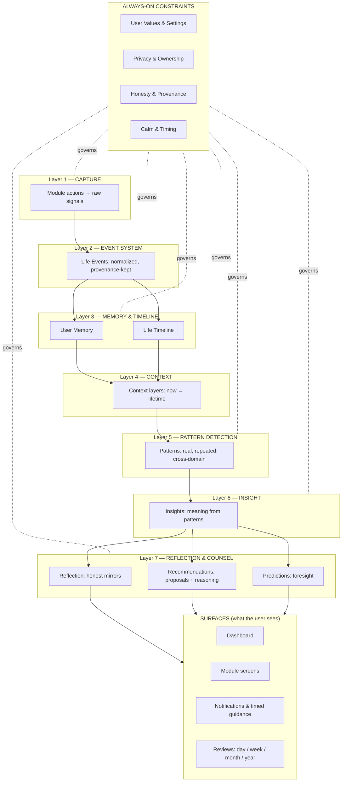
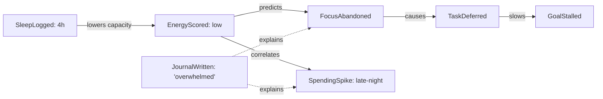
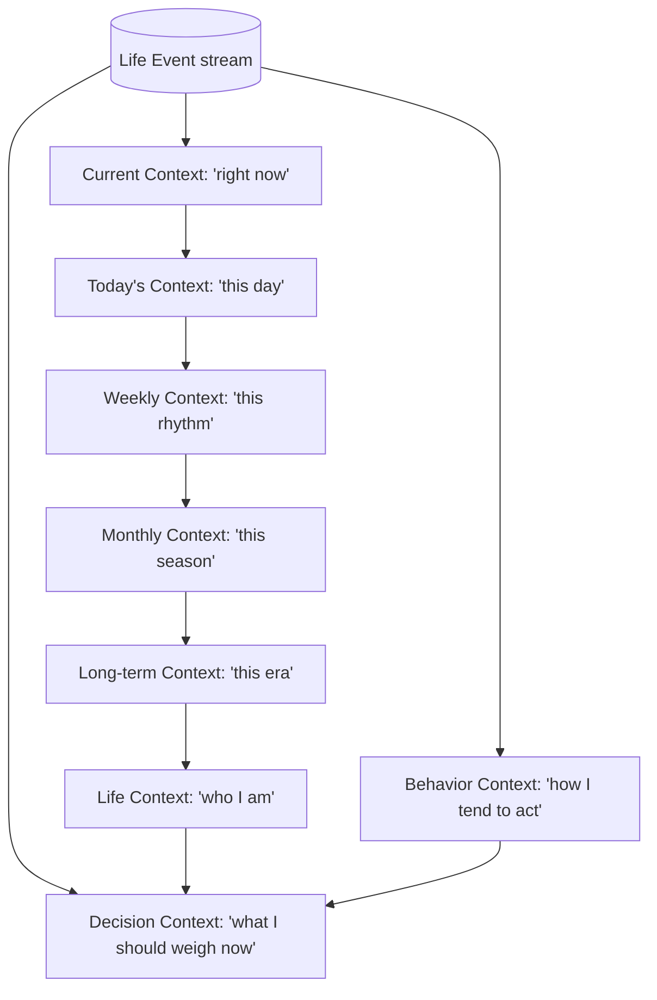
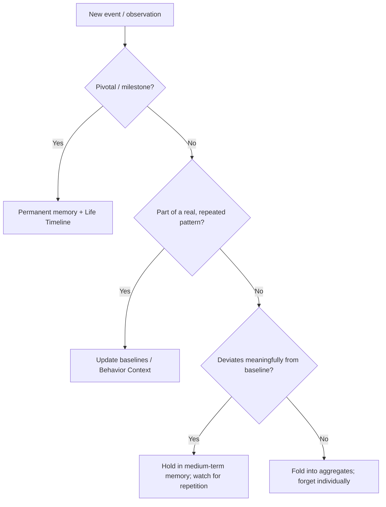
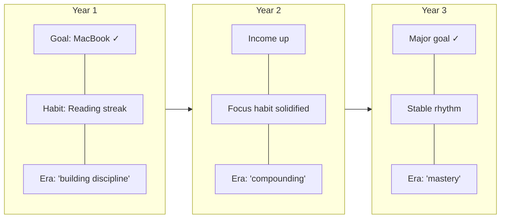
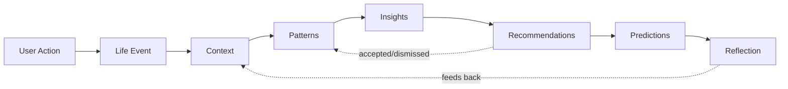
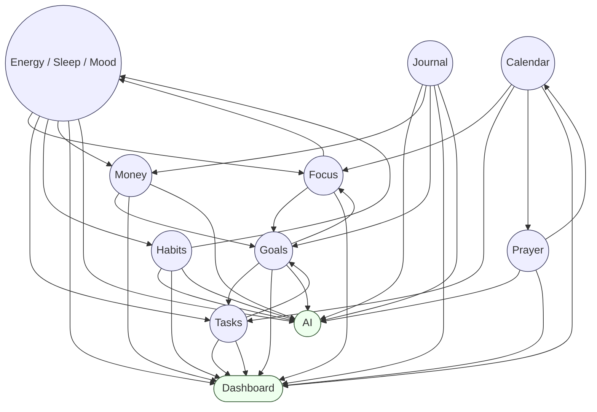

# ISA — Life Intelligence Engine (LIE)

> **Status:** Official · Permanent · Foundational
> **Document type:** System architecture — the conceptual brain of ISA.
> **Companion to:** [`ISA_CORE_PHILOSOPHY.md`](./ISA_CORE_PHILOSOPHY.md). Where philosophy states *what ISA believes*, this document states *how ISA thinks*.
> **Scope note:** This is architecture at the level of concepts, contracts, and data-flow — deliberately independent of any framework, database, or model. It is durable across a decade of implementation changes.
> **Reading rule:** The Engine is not an AI model and not a chatbot. It is the **layer that connects every module into one understanding of one life.** The model (if/when present) is only one *consumer* of the Engine.

---

## 1. First principles — why the Engine exists

### The core claim
> **A person's life is a single connected system. Software that stores each domain separately can never understand the person. The Life Intelligence Engine is the layer that makes ISA aware of the whole life at once.**

Every module in ISA (money, habits, focus, prayer, goals…) is an *organ*. Organs are useful. But a pile of organs is not an organism. The Engine is the **nervous system** — the thing that lets a signal in one organ change behavior in another, and lets the whole body know how it is doing.

### Why it is necessary (not optional)
Without the Engine, ISA is "six good apps in one login" — better than the competition, but still fundamentally a **collection of tools**. The differentiator, the moat, and the entire long-term thesis of ISA all live in the *relationships between domains*:

- The value of knowing you slept badly is small.
- The value of knowing you slept badly **and therefore** today's focus target should drop, your habit expectations should soften, and your late-night spending pattern is likely to recur — that value is enormous, and it is impossible without a connecting layer.

The Engine exists so ISA can answer the questions no single module can:
- *How is my life actually going?* (synthesis across domains)
- *Why do my good periods happen?* (cross-domain pattern detection)
- *What's about to go wrong?* (prediction from connected signals)
- *What should I do next, given everything about me?* (recommendation grounded in the whole person)

### First-principles definition
The Engine is a **deterministic, transparent, event-driven understanding of one human's life over time**, composed of:
1. a stream of **Life Events** (meaningful actions, normalized),
2. layered **Context** (the same events viewed at different time-scales and abstraction levels),
3. durable **Memory** (what ISA carries forward vs. lets fade),
4. a **Life Timeline** (the connected long-term record),
5. and a **Pipeline** that turns raw actions into reflection, insight, recommendation, and prediction.

Intelligence (rule-based today, model-augmented later) is applied **on top of** these structures — never in place of them. The structures are the brain's anatomy; models are one kind of thought.

---

## 2. Responsibilities of the Engine

### What the Engine MUST do
1. **Capture** every meaningful user action as a normalized Life Event.
2. **Connect** events across modules into one coherent picture of the person.
3. **Maintain context** at every relevant time-scale (now → lifetime).
4. **Detect patterns** honestly — real, repeated, statistically meaningful ones.
5. **Remember** what matters and **let go** of what doesn't, deliberately.
6. **Surface understanding** — reflection, insight, recommendation, prediction — with reasoning attached.
7. **Preserve provenance** — every insight must be traceable to the events that produced it.
8. **Respect timing** — hold intelligence until the moment it is useful; stay silent otherwise.
9. **Stay explainable** — no black boxes; the "because" is always reconstructable.
10. **Guard the user's agency** — output proposals, never commands or autonomous actions.

### What the Engine MUST NEVER do
1. **Never fabricate** patterns, insights, or certainty from noise or thin data.
2. **Never act autonomously** on the user's life (move money, message people, delete records).
3. **Never optimize the person as a machine** (output over well-being).
4. **Never manipulate** via urgency, guilt, gamification, or fear.
5. **Never leak, sell, or repurpose** the user's life data.
6. **Never hide reasoning** or present a conclusion it cannot justify.
7. **Never speak when silence serves the user better.**
8. **Never let one module's logic secretly corrupt another's** — connections are explicit, inspectable, and bounded.
9. **Never treat missing data as bad data** — absence is information, not failure.
10. **Never assume** it understands the person more than it truly does; it earns understanding over time and says so.

---

## 3. Engine Architecture (conceptual)

The Engine is a **layered brain**. Data flows upward from raw action to understanding; guidance flows back down to the surfaces the user sees. Each layer has a single responsibility and a clean contract with the layers above and below it.

**Layer responsibilities (contracts):**

| Layer | Responsibility | Input | Output |
|---|---|---|---|
| 1 · Capture | Turn a module action into a raw signal | User action | Raw signal |
| 2 · Event System | Normalize signals into typed Life Events with metadata & provenance | Raw signals | Life Events |
| 3 · Memory & Timeline | Persist what matters; connect events across time | Life Events | Durable memory + timeline |
| 4 · Context | View events at each time-scale & abstraction level | Events + memory | Context layers |
| 5 · Patterns | Find real, repeated, cross-domain regularities | Context | Patterns |
| 6 · Insight | Attach meaning ("what this means") | Patterns | Insights |
| 7 · Reflection / Recommendation / Prediction | Mirror the past, propose the next step, foresee the future | Insights + context | Reflection, proposals, forecasts |
| Constraints | Govern every layer: values, privacy, honesty, calm/timing | — | Guardrails |

The **Constraints band** is not a layer that runs once; it is a set of laws every layer obeys at all times. An insight that violates honesty is discarded at Layer 6. A recommendation that violates the user's values is discarded at Layer 7. A perfectly true insight delivered at the wrong moment is held by the calm/timing law.

---

## 4. Module contributions to the Engine

Every module is a **producer of Life Events and context** and a **consumer of intelligence.** Three modules are special and stated honestly:

- **Dashboard** is not a life domain — it is a **primary surface**: it reads the Engine and shows synthesis. It produces almost no events (only "user reviewed X"); it consumes nearly everything.
- **AI** is not a domain — it is the **expression of the Engine** (Layers 5–7). It produces meta-events ("insight shown," "recommendation accepted/dismissed") that feed back as learning signal.
- **Settings** is not a domain — it is where the user declares **values, constraints, and preferences** that become the always-on governing inputs (the Constraints band).

For each true life domain: *what it produces · life events it creates · context it stores · which modules react · future AI capabilities it unlocks.*

### Tasks (to-dos)
- **Produces:** intent, workload, follow-through, procrastination signals, daily load vs. completion.
- **Life events:** `TaskCreated`, `TaskCompleted`, `TaskDeferred`, `TaskDeleted`, `DayCleared` (all today's tasks done).
- **Context stored:** typical daily load, completion rate by day-of-week/energy, chronic deferrals, task→goal links.
- **Modules that react:** Dashboard (today's picture), Goals (task→goal progress), Focus (what to focus on), Calendar (scheduling load), AI (overload/procrastination detection).
- **Future AI:** realistic daily-load recommendations, procrastination prediction, "these three tasks keep slipping — schedule or drop them," auto-linking tasks to goals.

### Notes (Ideas)
- **Produces:** raw thought, ideas, interests, unstructured signal about what's on the person's mind.
- **Life events:** `NoteCaptured`, `NoteTagged`, `NoteRevisited`, `NotePromoted` (idea → goal/task/project).
- **Context stored:** recurring themes/interests, ideas that never became anything, topics that correlate with high-energy periods.
- **Modules that react:** Goals/Projects (promotion), AI (theme detection), Journal (thematic overlap).
- **Future AI:** "you keep noting X — want to make it a goal?", surfacing a forgotten relevant idea at the right moment, connecting ideas across years.

### Money
- **Produces:** income, spending, category behavior, savings velocity, financial pressure, goal fundability.
- **Life events:** `ExpenseAdded`, `IncomeReceived`, `SpendingSpike`, `SavingsGoalFunded`, `RecurringPaymentDue/Paid`, `BudgetBreached`.
- **Context stored:** category baselines, monthly cash-flow shape, spending↔mood/stress correlations, goal ETAs, recurring obligations.
- **Modules that react:** Goals (fundability & ETA), Dashboard (financial health), Journal (why a spike happened), AI (financial foresight), Calendar (paydays/obligations).
- **Future AI:** cash-flow prediction, "at this pace you'll miss your target by 3 weeks," stress-spending early warning, "reduce X to fund goal Y."

### Goals
- **Produces:** direction, ambition, long-term intent, the "what am I climbing toward" signal.
- **Life events:** `GoalCreated`, `GoalProgressed`, `GoalStalled`, `GoalCompleted`, `GoalAbandoned`, `DeadlineApproaching`.
- **Context stored:** active directions, pace vs. deadline, which life domains each goal depends on, momentum history.
- **Modules that react:** Tasks (goals generate work), Money (goals need funding), Focus (goals justify deep work), Dashboard (the Ascent), AI (trajectory & drift detection).
- **Future AI:** trajectory prediction, "this goal has stalled 3 weeks — revive, reshape, or release?", allocating the day's effort toward the most at-risk important goal.

### Calendar
- **Produces:** time structure, commitments, availability, the shape of the day/week.
- **Life events:** `EventCreated`, `EventStarting`, `DayBusy/Light`, `FreeBlockAvailable`.
- **Context stored:** recurring rhythms, busy vs. free patterns, when focus is realistically possible, collision with energy troughs.
- **Modules that react:** Focus (when to schedule deep work), Tasks (when work fits), Prayer (time-boundedness), AI (realistic planning).
- **Future AI:** "your only free block today is 4–5pm — protect it for your most important task," predicting over-committed days, guarding rest.

### Habits
- **Produces:** consistency, identity-level behavior, the slow-compounding signal, fragility of routines.
- **Life events:** `HabitCompleted`, `HabitMissed`, `StreakExtended`, `StreakBroken`, `HabitFragile` (pattern of near-misses).
- **Context stored:** per-habit reliability, day/context conditions for success/failure, habit↔energy/sleep correlations, identity themes.
- **Modules that react:** Dashboard (momentum), Energy/Focus (habits shape capacity), AI (fragility & relapse prediction), Journal (why a habit slipped).
- **Future AI:** relapse prediction ("you miss Reading on high-workload days — want a lighter version those days?"), habit-stacking suggestions grounded in real success conditions.

### Prayer
- **Produces:** spiritual practice, values-adherence, daily rhythm anchored in faith, a non-negotiable structure of the day.
- **Life events:** `PrayerCompleted` (on time / late), `PrayerMissed`, `PrayerWindowOpen`, `DayOfPrayerComplete`.
- **Context stored:** on-time vs. late patterns, which prayers slip and under what conditions, spiritual consistency over time, the day's anchor times.
- **Modules that react:** Calendar/Focus (day structure around prayer times), Dashboard (whole-person picture), AI (respecting values as a hard constraint), Habits (consistency family).
- **Future AI:** protecting prayer windows when scheduling, gentle values-aligned reflection, recognizing that a values anchor holding is a sign of a stable life period. *Faith is treated as a first-class, respected dimension — never optimized away.*

### Focus (deep work)
- **Produces:** attention, cognitive output, energy expenditure, the "real work happened" signal.
- **Life events:** `FocusStarted`, `FocusCompleted`, `FocusAbandoned`, `DeepWorkStreak`.
- **Context stored:** best focus times of day, sustainable session lengths, focus↔sleep/energy correlation, what focus tends to serve (which goals).
- **Modules that react:** Goals (focus advances them), Energy (focus draws on it), Calendar (scheduling), Dashboard (weekly focus), AI (capacity modeling).
- **Future AI:** "your focus is best 9–11am and collapses after a poor night — front-load deep work," predicting a low-focus day and adjusting the plan.

### Energy / Sleep / Mood (the well-being domain)
- **Produces:** capacity, recovery, emotional state — the substrate everything else runs on.
- **Life events:** `SleepLogged`, `EnergyScored`, `MoodLogged`, `LowEnergyDay`, `RecoveryDay`.
- **Context stored:** sleep/energy baselines & consistency, mood trends, the causal spine linking rest → capacity → output → spending/habits.
- **Modules that react:** *Everything.* Energy is the multiplier on Tasks, Focus, Habits, Money-discipline, and Goals.
- **Future AI:** "you're running a sleep deficit — today, do less and protect recovery," predicting burnout, explaining a bad week through its energy root cause.

### Journal
- **Produces:** meaning, narrative, the *why* behind the numbers — the qualitative layer.
- **Life events:** `JournalWritten`, `MoodRecorded`, `ReflectionThemeDetected`.
- **Context stored:** emotional themes, self-reported causes, the story that explains cross-domain data, what the person says they care about.
- **Modules that react:** AI (grounds recommendations in the person's own words), Dashboard (context for the numbers), Goals/Money (the "why" behind spikes and stalls).
- **Future AI:** connecting a journaled feeling to its data signature ("the week you wrote about feeling stretched was also your worst sleep + highest spend"), values extraction, long-term narrative reflection.

### Running / Health (extensible physical domain)
- **Produces:** physical activity, another well-being input, discipline evidence.
- **Life events:** `RunLogged/Synced`, `ActivityStreak`, `InactivityGap`.
- **Context stored:** activity baselines, activity↔energy/mood correlation.
- **Modules that react:** Energy/Mood, Habits, Dashboard, AI.
- **Future AI:** activity↔energy causal insight, gentle movement recommendations tied to mood dips.

### Meta modules (stated honestly)
| "Module" | True role | Contribution to the Engine |
|---|---|---|
| **Dashboard** | Primary read surface | Consumes synthesis; emits only `Reviewed*` meta-events. |
| **AI** | The Engine's Layers 5–7 made visible | Emits `InsightShown`, `RecommendationAccepted/Dismissed`, `PredictionMade` — the learning-signal loop. |
| **Settings** | Declaration of values & constraints | Feeds the always-on Constraints band (values, quiet hours, priorities, tier). |

### Future modules (extensibility contract)
Any future module (relationships, learning/study, work/career, health-vitals, projects-at-scale) **must** on arrival declare the same five things: *what it produces · its life events · the context it stores · which modules react · which AI capabilities it unlocks.* A module that cannot fill this contract does not belong in ISA — it would be a silo, and silos are forbidden by the philosophy.

---

## 5. The Event System

Everything the Engine knows begins as a **Life Event**: a normalized, timestamped, provenance-bearing record of a meaningful action or state-change. Events are the **single source of truth** the higher layers reason over.

### 5.1 Design rules for events
1. **Normalized:** every event, regardless of module, shares one shape so cross-module reasoning is possible.
2. **Immutable & append-only:** events record what happened; they are not edited. Corrections are new events. This preserves an honest history.
3. **Provenance-bearing:** every event knows its origin module and the raw action behind it — so any insight can be traced back.
4. **Semantically typed:** the *type* carries meaning (`HabitMissed`, not "row updated"), because the Engine reasons in life-terms, not database-terms.
5. **Absence-aware:** the *lack* of an expected event (no journal today, no prayer logged) is itself a signal the Engine can reason about.

### 5.2 Event anatomy (metadata contract)
| Field | Meaning | Example |
|---|---|---|
| **Type** | The life-meaning of the event | `ExpenseAdded`, `GoalCompleted`, `PrayerMissed` |
| **Domain** | Producing module | Money, Goals, Prayer |
| **Timestamp** | When it happened (user-local) | 2026-07-12 21:14 (+05) |
| **Actor** | Who caused it | user / system / recurring-job |
| **Payload** | Domain-specific facts | amount, category, prayer name, goal id |
| **Magnitude** | How big/notable relative to the user's own baseline | "1.3× your Food average" |
| **Valence** | Direction relative to the person's goals/values | positive / neutral / negative / ambiguous |
| **Links** | Related entities across modules | expense → goal it drains; task → goal it serves |
| **Importance** | Weight for attention & memory (see §5.3) | trivial → pivotal |
| **Provenance** | Raw source, for explainability | "manual entry" / "Strava sync" |

### 5.3 Event importance (attention & memory weight)
Not all events deserve equal attention or permanence. Importance is judged **relative to the individual**, never absolutely.

| Tier | Definition | Attention | Memory horizon |
|---|---|---|---|
| **Trivial** | Routine, expected, in-baseline | none | short (fades into aggregates) |
| **Notable** | Mild deviation from the person's norm | maybe, in aggregate | medium (weeks) |
| **Significant** | Clear deviation or meaningful milestone | eligible to surface | long (months) |
| **Pivotal** | Life-shaping (goal finished, streak of a long habit broke, major income change) | surfaced & remembered | permanent (Life Timeline) |

Importance is **dynamic**: a single missed prayer is Trivial; a *pattern* of missed prayers becomes Significant; the same event's importance rises when it participates in a cross-domain pattern.

### 5.4 Event relationships
Events are not a flat log; they form a **graph**:
- **Causal links:** poor `SleepLogged` → likely `FocusAbandoned` → `TaskDeferred`.
- **Serving links:** `TaskCompleted` → advances `GoalProgressed`; `ExpenseAdded` → drains `SavingsGoal` fundability.
- **Explanatory links:** `SpendingSpike` ↔ `JournalWritten` ("stressful week") ↔ `LowEnergyDay`.
- **Temporal links:** events chain into days, weeks, seasons on the Life Timeline.

This graph — not any single event — is what lets ISA say something no module could: *"Your goal stalled this week because a bad night cascaded into skipped focus and stress-spending — and you felt it, you wrote 'overwhelmed.'"*

---

## 6. Context Layers

The **same events** are viewed through multiple lenses simultaneously. Context is not extra data — it is *perspective* on the event stream. Each layer answers a different question and serves different intelligence.

| Layer | Question it answers | Time window | Primary use |
|---|---|---|---|
| **Current** | "What is true this exact moment?" | now (minutes) | timely nudges, "next prayer in 20m," protect the free block |
| **Today** | "What is this day shaped like?" | today | the daily picture, realistic load, morning intent / evening review |
| **Weekly** | "What is my rhythm?" | rolling 7 days | pattern onset, "this week vs last," the weekly review |
| **Monthly** | "What season am I in?" | rolling ~30 days | cash-flow shape, goal pace, habit reliability, monthly review |
| **Long-term** | "What era am I in?" | quarters / years | trajectory, life-phase shifts, multi-year trends |
| **Life** | "Who is this person, fundamentally?" | lifetime | durable identity, values, stable traits — the deep model |
| **Behavior** | "How does this person tend to act?" | learned over time | prediction & recommendation grounding (tendencies, not events) |
| **Decision** | "Given everything, what should I weigh right now?" | synthesized on demand | the input to any recommendation — fuses Life + Behavior + Current |

**Key architectural idea — Decision Context:** when the Engine is about to advise or predict, it assembles a **Decision Context** — a fused snapshot of *who the person is* (Life), *how they tend to behave* (Behavior), and *what is true now* (Current). Recommendations are computed from Decision Context, never from a single layer. This is what makes ISA's advice feel like it comes from someone who *knows you*, not from a rule reacting to one data point.

---

## 7. User Memory

The Engine deliberately distinguishes **remembering** from **storing**. Everything is stored (the event log is permanent and the user's); but the Engine's *working memory* — what it actively carries into reasoning — is curated, because a mind that remembers everything equally understands nothing.

### 7.1 What ISA should remember (carry forward, actively)
- **Baselines & norms:** the person's typical sleep, spend-by-category, daily task load, focus window, habit reliability.
- **Stable patterns:** "energy dips Thursdays," "good weeks start with a Sunday review," "stress → late-night spending."
- **Identity & values:** declared priorities, faith practice, what the person says matters — the hard constraints on advice.
- **Milestones:** goals reached/abandoned, major income changes, long streaks made/broken — the Life Timeline anchors.
- **Preferences learned from feedback:** which insights were accepted vs. dismissed; how and when the person likes to be spoken to.

### 7.2 What ISA should forget (let fade into aggregates)
- **Trivial, in-baseline events** individually — a normal coffee expense matters as part of the "Food baseline," not as a remembered moment.
- **Superseded state:** old baselines once new ones stabilize (people change; the model must too).
- **One-off noise:** anomalies that never repeat and never linked to anything.
- **Stale predictions & dismissed insights** (kept only as feedback signal, not as active beliefs).

> Forgetting is a *feature of understanding*. It is how the Engine keeps a clear, current picture instead of an ever-heavier archive. The raw events remain available; it is the *active model* that stays lean.

### 7.3 What becomes permanent knowledge
- **Pivotal life events** (Life Timeline).
- **Durable identity/values** (Life Context) — changed only by strong, repeated evidence.
- **The event log itself**, as the user's inviolable record and export.

### 7.4 Memory decision tree

---

## 8. The Life Timeline

The Life Timeline is the **connected long-term record of a life** — the structure that turns a decade of events into a story ISA (and the user) can read.

- **Structure:** a continuous spine of time, threaded by **domain lanes** (money, goals, habits, energy, faith, focus…) and marked by **anchors** (pivotal events).
- **Connection principle:** the timeline's power is *vertical* — being able to slice any moment and see *all domains at once* ("in March, sleep collapsed, a goal stalled, spending spiked, and the journal explains why"), and *horizontal* — following one thread across years ("your saving discipline strengthened every year since 2026").
- **Eras & seasons:** the Engine segments the timeline into **eras** (long phases with stable characteristics) and **seasons** (monthly moods), so the user can see their life in chapters, not just days.
- **Reflection surface:** the timeline is what powers yearly review and, eventually, multi-year counsel — "here is who you were, here is who you're becoming."

**Rule:** the timeline is never a wall of raw logs shown to the user. It is *read* by the Engine to produce reflection; the user sees *meaning*, not a database dump. (Intelligence over Information, applied to time.)

---

## 9. Recommendation Inputs

Before ISA advises, it gathers a defined set of signals. A recommendation made without these is forbidden (it would be generic advice — an anti-pattern).

**Signals collected before any recommendation:**
1. **Decision Context** (§6): who the person is + how they behave + what's true now.
2. **Active goals & their state** — what the person is trying to achieve, and which are at risk.
3. **Declared values & constraints** — faith, priorities, quiet hours, hard limits (from Settings).
4. **Current capacity** — energy, sleep debt, mood, calendar load (can they act on this today?).
5. **Relevant baselines** — is the situation actually a deviation, or normal for this person?
6. **Cross-domain links** — does the money situation touch a goal? does the calendar block the focus?
7. **Recent feedback** — what similar advice did the person accept or dismiss before?
8. **Timing appropriateness** — is *now* a moment where advice helps, or would it be noise/pressure?

**Recommendation quality contract:** every recommendation must be **specific** (to this person's data), **grounded** (traceable to events), **bounded** (respects values & capacity), **optional** (a proposal), and **timely** (delivered when actionable). Fails any → not shown.

---

## 10. Prediction Inputs

Prediction is Phase-III intelligence. Each predictable dimension draws on a defined signal set. Predictions are always **probabilistic and explainable** ("likely, because…"), never oracular.

| Predict | Primary inputs | Example foresight |
|---|---|---|
| **Productivity** | historical completion rate by day/energy, calendar load, sleep, focus history, task backlog | "Tomorrow looks over-committed given your energy — plan for 2 key tasks, not 6." |
| **Money** | income cadence, category baselines, recurring obligations, month-to-date pace, spend↔mood links | "At this pace you'll overshoot your budget by ~15% and miss the goal ETA by 3 weeks." |
| **Goals** | progress velocity, deadline, dependency on money/energy/focus, historical stall patterns | "This goal is trending to finish 6 weeks late unless weekly focus rises." |
| **Habits** | per-habit reliability, near-miss pattern, success conditions (sleep/workload/day), streak fragility | "Reading is fragile this week — high workload days are when you miss it." |
| **Energy** | sleep trend & consistency, activity, mood, recent load, historical recovery patterns | "You're building a sleep deficit; a low-capacity day is likely Thursday." |
| **Focus** | best-time-of-day model, session-length sustainability, sleep/energy, calendar collisions | "Your deep-work capacity will be low tomorrow morning after tonight's short sleep." |

**Prediction laws:**
1. **No prediction from thin data** — below a real evidence threshold, ISA says "not enough history yet."
2. **Always explainable** — a forecast the Engine can't justify is not shown.
3. **Always actionable or omitted** — a prediction the user can't influence is often better left unsaid (calm).
4. **Foresight serves prevention** — the purpose is to help pre-empt, not to alarm.

---

## 11. The Intelligence Pipeline

The permanent path from raw action to wisdom. Each stage has one job and hands a clean product to the next. This pipeline is the Engine's "how" in one line.

| Stage | What happens | Input → Output | Governing law |
|---|---|---|---|
| **1 · User Action** | The person does something meaningful in a module | interaction → raw signal | capture faithfully |
| **2 · Life Event** | Signal normalized, typed, weighted, linked, provenance kept | signal → event | honesty & provenance |
| **3 · Context** | Event folded into every time-scale & behavioral lens | event → context layers | completeness |
| **4 · Patterns** | Real, repeated, cross-domain regularities detected; noise rejected | context → patterns | no fabrication |
| **5 · Insights** | Meaning attached — "what this means" with its reasoning | patterns → insight | intelligence > information |
| **6 · Recommendations** | A grounded, bounded, optional proposal, if warranted | insight + Decision Context → proposal | agency + values |
| **7 · Predictions** | Probable, explainable foresight, if data supports it | insight + behavior model → forecast | probabilistic + actionable |
| **8 · Reflection** | Honest mirrors across day/week/month/year; the story | everything → reflection | calm + truth |

**Feedback loops (why the Engine gets smarter over time):**
- **Reflection → Context:** last period's synthesis becomes context for the next (the system has a memory of how it summarized you).
- **Recommendation outcome → Patterns:** accepted/dismissed proposals refine what counts as a useful pattern *for this person*. This is how ISA learns your taste in advice without a model — and later, with one.

**Crucial rule:** every stage can output **nothing**. No pattern? No insight. No warranted proposal? Silence. The pipeline is not a content generator; it is a truth filter. Most raw actions produce no visible intelligence — and that is correct.

---

## 12. Cross-Module Intelligence

This is the payoff of the whole architecture: **the connections are the product.** Below are representative, load-bearing relationships. They are *rules of reasoning*, not features — the Engine applies them continuously.

### Relationship map (illustrative)

### Representative reasoning rules
| When… | …the Engine reasons… | Producing |
|---|---|---|
| **Sleep drops** | capacity is down today | lower suggested task load; soften habit expectations; warn focus will be weak |
| **Money is tight** | goals slow; stress rises | flag at-risk goal ETAs; watch for stress-spending; connect to journal mood |
| **A goal is finished** | momentum is available | offer it to the next goal; mark a Life Timeline anchor; reflect it into the yearly story |
| **Goals exist** | they must generate work | suggest linking tasks to goals; surface goals with no recent task activity (drift) |
| **Tasks pile up undone** | overload or avoidance | detect procrastination; propose scheduling or dropping chronic deferrals |
| **Calendar is packed** | no room for deep work | protect the one free block; predict an over-committed day; guard rest & prayer windows |
| **Habits hold** | the person is in a stable era | raise confidence in ambitious recommendations; reflect strength |
| **Habits fracture** | routine is fragile | predict relapse from success-conditions; offer a lighter version, not guilt |
| **Prayer times anchor the day** | structure exists to plan around | schedule focus/tasks around prayer; treat prayer windows as immovable |
| **Journal says 'overwhelmed'** | there is a felt cause behind the numbers | ground recommendations in the person's words; connect feeling to its data signature |
| **Focus is best at 9–11am** | capacity has a shape | recommend front-loading deep work; warn when a bad night threatens that window |
| **Energy + Money + Goals all dip together** | a hard season is underway | zoom out, name the season honestly, prioritize recovery over output |

### The synthesis that no competitor can produce
> *"Your goal stalled this month. The root cause wasn't laziness — it was a run of short sleep that cut your morning focus, which is when you make progress. That same tiredness shows up as late-night spending, which is why the goal's funding also slipped, and your journal on the 14th ('stretched thin') matches exactly. This is a recovery week, not a discipline problem. Protect sleep; the rest recovers with it."*

That sentence requires Money **and** Goals **and** Focus **and** Energy **and** Journal to be one connected understanding. That sentence is ISA. No single-domain tool can ever say it.

---

## 13. Temporal Intelligence

The Engine expresses itself at four cadences, each with a distinct job. Same brain, different zoom.

| Cadence | Question | The Engine's job | Tone |
|---|---|---|---|
| **Daily** | "What matters today?" | one clear, realistic picture: today's load vs. capacity, the one thing that matters, timely nudges. Never a firehose. | present, gentle, actionable |
| **Weekly** | "What was my rhythm?" | honest mirror of the week; the first place real patterns become visible; one thing to carry forward. | reflective, pattern-first |
| **Monthly** | "What season am I in?" | cash-flow shape, goal pace, habit reliability, energy trend — the health of the month; the first place *foresight* becomes reliable. | evaluative, trend-first |
| **Yearly** | "Who am I becoming?" | the life story: eras, milestones, growth across domains; the deepest reflection ISA offers; the payoff of a decade of data. | narrative, identity-first |

**Design laws for temporal intelligence:**
1. **Zoom, don't repeat.** Each cadence says something the others can't; weekly is not "seven dailies stacked."
2. **Longer horizon → higher bar for confidence** and lower frequency of interruption.
3. **The year is sacred.** Yearly reflection is where "Teach Instead of Store" fully pays off — the user learns who they are. It must be profound, honest, and unhurried.
4. **Every cadence ends with meaning, not metrics.** A number without a takeaway is a failure at any zoom level.

---

## 14. Why ISA is fundamentally different

Every tool below is excellent at one slice. Each is, architecturally, a **silo with no nervous system.** ISA's difference is not features — it's the Engine.

| Tool | What it is | Its structural ceiling | What ISA does instead |
|---|---|---|---|
| **Notion** | A flexible container you must structure yourself | It stores whatever you build; it understands none of it. The user is still the intelligence. | ISA *understands* the life inside it and connects domains automatically — the intelligence is the product, not the user's manual labor. |
| **Todoist** | A best-in-class task list | A task is an island; it doesn't know your energy, money, goals, or why you keep deferring. | ISA sees tasks as *one organ* — linked to goals, capacity, calendar, and follow-through patterns. |
| **Google Calendar** | Time blocks | It knows *when*, never *whether you should*, or how a day collides with your energy and priorities. | ISA reasons about time *against the whole person* — capacity, goals, prayer, focus windows. |
| **Apple Notes** | A place to dump text | Inert. Notes never become goals, never resurface at the right moment, never connect to anything. | ISA treats ideas as live signal — themes detected, promotion offered, relevant thoughts resurfaced in context. |
| **Money managers** | Transaction ledgers & charts | They optimize money in isolation — blind to your goals, stress, energy, and why you spent. | ISA connects money to goals, mood, and life-season; spending is understood, not just logged. |
| **AI chatbots** | A brilliant stranger behind a prompt | No persistent, structured model of *your* life; you must re-explain yourself every time; it reacts, never anticipates; it will confidently invent. | ISA has a durable, honest, event-grounded model of one life; intelligence is **ambient and anticipatory**, always traceable, never fabricated, and it *knows you already*. |

### The core distinction, stated once
> **Every competitor is a tool you operate. ISA is a system that understands you.**
>
> A tool waits for input and gives output. An operating system holds the whole environment, coordinates every part, and knows the state of the whole. ISA is a *Life* Operating System because the Life Intelligence Engine does for a human life what an OS does for a computer: it makes the pieces one coherent, self-aware system.

A collection of productivity tools can make you *organized.* Only a connected intelligence can help you *understand yourself and move your life forward.* That connection — the Engine described in this document — is the permanent reason ISA exists and the permanent reason it cannot be reduced to the sum of its modules.

---

## Appendix A — Glossary
- **Life Event:** a normalized, provenance-bearing record of a meaningful action/state-change; the Engine's source of truth.
- **Context Layer:** a perspective (time-scale or abstraction) on the event stream.
- **Decision Context:** the fused snapshot (identity + behavior + now) used to generate any recommendation.
- **Life Timeline:** the connected long-term record; the substance of long-horizon reflection.
- **Pattern:** a real, repeated, cross-domain regularity — never a one-off.
- **Insight:** a pattern with meaning and reasoning attached.
- **Constraints band:** the always-on laws (values, privacy, honesty, calm/timing) every layer obeys.

## Appendix B — Non-negotiable engine laws (quick reference)
1. Connections are the product; silos are forbidden.
2. Understanding over information, always.
3. Every insight is traceable to its events.
4. No fabrication from noise or thin data.
5. The human decides; the Engine proposes.
6. Values and privacy are hard constraints, not preferences.
7. Silence is the default; speaking must be earned.
8. Forgetting is part of understanding.
9. Every stage may output nothing — the pipeline is a truth filter, not a content mill.
10. Optimize the person's life, never the app's engagement.

---

*End of Document 2 — ISA Life Intelligence Engine. This is the brain. Every module plugs into it; nothing bypasses it.*
